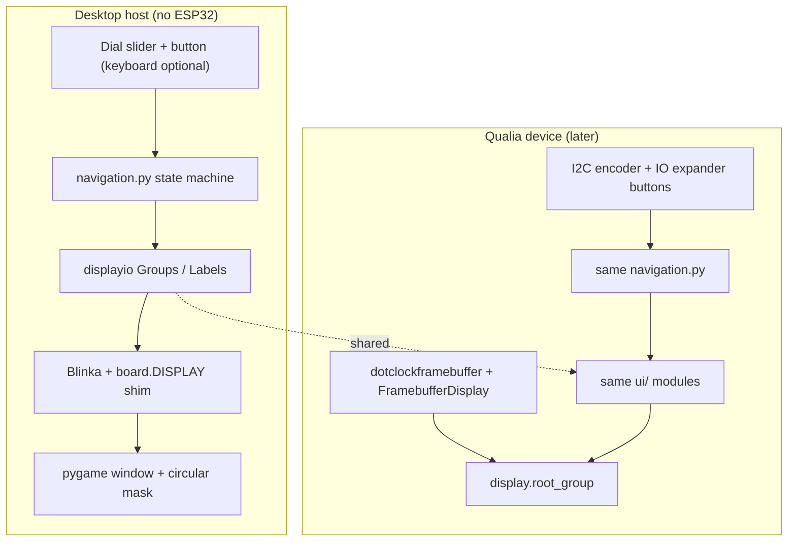

# Desktop displayio Watch Emulator — Roadmap

Build a **local desktop** simulator that mirrors `DESKTOP-EMULATOR-LAUNCH/watch_app_simulator.html` (watch face → app library → mini-apps), but draws with **CircuitPython-style `displayio`** APIs so UI code can later run on the **Qualia ESP32-S3 + 2.1" 480×480 round display** with minimal changes. **No ESP32 required** for day-to-day development.

> **Development constraints (required reading):** [07_portable_development_constraints.md](07_portable_development_constraints.md) — layer boundaries, allowed APIs, forbidden patterns, assets, testing gates.

---

## Goals

| Goal | Detail |
|------|--------|
| Parity with HTML simulator | Same navigation: dial scrolls views / list; button selects / context actions / back |
| displayio-first | `Group`, `TileGrid`, `Bitmap`, `Label` (or `bitmap_label`), palettes — not DOM/CSS |
| Hardware fidelity | **480×480** logical framebuffer; circular mask in the desktop shell only |
| Portable to device | Shared `apps/` + `ui/` modules; thin `host/` vs `device/` entrypoints |
| Local only | Python 3.10+ on macOS/Linux/Windows; no browser, no board plugged in |

## Non-goals (v1)

- Bit-perfect `dotclockframebuffer` / RGB-666 timing emulation on desktop
- WiFi, BLE, or real CST826 touch hardware
- Shipping a full CircuitPython runtime inside the repo

---

## Reference: What the HTML Simulator Does

From `watch_app_simulator.html`:

1. **Views:** `watch` (clock) ↔ `library` (app list) ↔ `app` (selected mini-app)
2. **Dial:** Threshold (`DIAL_SWITCH ≈ 30`) slides between watch and library; in library, dial delta moves selection
3. **Button:** Watch → library; library → launch app; app → per-app action or back
4. **Apps:** To-do, Timer, Counter, Clock (world), Notes — each with simple content + button behavior

The displayio version will implement the **same state machine** and app registry; only rendering and input adapters differ.

---

## Architecture Overview



**Principle:** One codebase for **screens + apps**; two thin **platform layers** (`host/` vs `device/`).

---

## Technology Choice: Running displayio on Desktop

On the Qualia (per `Docs/03_display_setup.md`), the pipeline is:

`DotClockFramebuffer` → `FramebufferDisplay` → `displayio` (`Group`, `TileGrid`, …).

On desktop, **native `displayio` is not in CPython**. Practical options:

| Approach | Pros | Cons |
|----------|------|------|
| **A. Blinka DisplayIO + pygame** (recommended) | Closest to device APIs; Adafruit-maintained path | Extra deps; setup docs needed |
| **B. `adafruit_displayio_emulator` / host framebuffer** | Good for CI headless tests | May lag Blinka; verify version |
| **C. Manual pygame blit of Bitmap buffers** | Full control | Duplicates displayio; harder port |

**Roadmap default: Approach A** — install [Blinka](https://github.com/adafruit/Adafruit_Blinka) with a display shim that presents a `displayio`-compatible `DISPLAY` to your script, backed by pygame (same family as existing `circular_popup_pygame.py`).

If Blinka displayio setup is brittle on a given OS, **fallback:** implement a minimal `HostDisplay` that only implements `width`, `height`, `root_group`, and `refresh()` by rasterizing the root `Group` to a pygame surface (Phase 0 spike).

---

## Target Repository Layout

```
DESKTOP-EMULATOR-LAUNCH/
  watch_app_simulator_displayio.py   # host entry: pygame + input loop
  host/
    display_setup.py                 # Blinka/pygame DISPLAY init, 480×480
    input_dial_button.py             # maps slider/keys → dial delta, button edge
    circular_mask.py                 # clip blit to circle (visual only)
  shared/
    navigation.py                    # watch | library | app state machine
    apps_registry.py                 # app metadata (name, color, view id)
    apps/
      watch_face.py
      library.py
      todo.py
      timer.py
      counter.py
      clock_world.py
      notes.py
  device/                            # added when hardware ready
    main.py                          # release_displays, dotclock init, encoder
    qualia_display.py                # from Docs/03 (TL021WVC02 timings)
    input_encoder.py                 # seesaw / UP-DN buttons per Docs/04

Docs/
  06_desktop_displayio_emulator_roadmap.md   # this file
```

`requirements.txt` (evolve incrementally):

```
pygame>=2.5
Adafruit-Blinka
# plus displayio shim packages per Blinka learn guide for your OS
```

---

## Display & Coordinate Model

Align with hardware docs:

| Parameter | Value | Source |
|-----------|-------|--------|
| Resolution | 480 × 480 | TL021WVC02 (`Docs/03_display_setup.md`) |
| Shape | Round (mask on desktop) | Physical display |
| Color | RGB565 palettes in `Bitmap` | `Docs/03` examples |
| Fonts | `adafruit_bitmap_font` + BDF on disk | Same files copied to `CIRCUITPY` later |

**Circular mask:** Applied only in `host/circular_mask.py` when compositing to the pygame window. **Logical layout stays square** so positions match device pixels 1:1.

**Safe area:** Inset ~24 px from edges for text (round display corners clip content).

---

## UI Mapping: HTML → displayio

| HTML concept | displayio implementation |
|--------------|---------------------------|
| Full-screen view | `displayio.Group` per view; swap `display.root_group` or single root with visible child groups |
| Watch time / date | `bitmap_label.Label` + `rtc` or host `time` module |
| Library list | `Group` of rows: small `Bitmap` icon tile + `Label`; highlight via palette swap or background `vectorio` rect |
| Slide between watch / library | **Option 1 (v1):** instant swap (no animation) — matches simplest CP perf. **Option 2:** offset `Group.x` in steps over ~15 frames |
| App icons (emoji/colors) | Pre-rendered 40×40 `Bitmap` assets in `/assets/icons/` (BMP or generated at startup) |
| Timer / counter dynamic text | Update `Label.text` or redraw small region |

Reuse patterns from `Docs/03`:

```python
group = displayio.Group()
group.append(tile_grid_or_labels)
display.root_group = group
```

---

## Input Mapping: HTML Controls → Host → Device

| Simulator control | Host (desktop) | Device (Qualia) |
|-------------------|----------------|-----------------|
| Dial slider | `input` event → `dial_delta` | I2C rotary encoder position delta (`Docs/04`) |
| Press button | UI button / `Space` / `Enter` | UP/DN or external button on CS / expander (`Docs/04`) |
| Touch | Optional: pygame mouse in circle → stub for CST826 later | `adafruit_cst8xx` (`Docs/03`) |

**Shared API:**

```python
class InputEvent:
    dial_delta: int      # -1, 0, +1
    button_pressed: bool # edge-triggered
```

`navigation.py` consumes `InputEvent` only — same as HTML `dial` / `btnSelect` listeners.

---

## Navigation State Machine (port from HTML)

States: `watch` | `library` | `app`

| State | Dial behavior | Button behavior |
|-------|---------------|-----------------|
| `watch` | Accumulate toward threshold → `library` | → `library` |
| `library` | Below threshold → `watch`; else change `lib_index` | → `app` (selected) |
| `app` | Below threshold → `watch` (restore face) | App-specific (timer start/stop, counter++, else → `library`) |

Constants to mirror HTML: `DIAL_SWITCH = 30` (map host dial 0–100 to same thresholds).

Implement once in `shared/navigation.py`; unit-test with fake `InputEvent` lists (no pygame).

---

## Phased Implementation Plan

### Phase 0 — Spike (1–2 days)

- [ ] Confirm Blinka + pygame `DISPLAY` works on dev machine (blank `Label` "Hello")
- [ ] If blocked, implement minimal `HostDisplay.refresh()` blit path
- [ ] Draw 480×480 black root + white circle border in pygame

**Exit:** Window opens, `displayio` root group visible.

### Phase 1 — Shell + navigation (2–3 days)

- [ ] `host/display_setup.py`: 480×480, `auto_refresh` loop ~30 FPS
- [ ] `host/input_dial_button.py`: slider or keys → `InputEvent`
- [ ] `shared/navigation.py` + empty views (solid color per state)
- [ ] View badges / debug overlay optional (host only)

**Exit:** Dial/button switch watch ↔ library with no apps yet.

### Phase 2 — Watch face + library (2–3 days)

- [ ] `watch_face.py`: live clock (host `time`; device `rtc` later)
- [ ] `library.py`: render `apps_registry` list, selection highlight
- [ ] Port `apps_registry.py` from HTML `apps` array

**Exit:** Feature parity for browsing apps (no app bodies).

### Phase 3 — Mini-apps (3–5 days)

Port each HTML `buildAppContent` case:

| App | displayio notes |
|-----|-----------------|
| To-do | Static labels + checkbox circles (`vectorio.Circle` or small Bitmap) |
| Timer | `Label` + `supervisor` ticks on device; `time.monotonic` on host |
| Counter | `Label` text update on button |
| Clock world | Multiple `Label` rows; host timezone math |
| Notes | Placeholder label |

**Exit:** Full HTML feature parity on desktop.

### Phase 4 — Polish (1–2 days)

- [ ] Circular mask + bezel styling (match HTML 340→480 scale or 1:1 window)
- [ ] `assets/` fonts and icons; document BMP pipeline (`Docs/03`)
- [ ] README section: `python DESKTOP-EMULATOR-LAUNCH/watch_app_simulator_displayio.py`

### Phase 5 — Device port (when hardware available)

- [ ] `device/qualia_display.py`: copy init sequence + `tft_timings` from `Docs/03` (TL021WVC02)
- [ ] `device/input_encoder.py`: encoder + button per `Docs/04`
- [ ] `device/main.py`: import **same** `shared/navigation` and `shared/apps/*`
- [ ] Copy `assets/` and fonts to `CIRCUITPY`; verify `circup` library versions (`Docs/02`)

**Exit:** Same UX on physical 2.1" round display.

---

## Differences: Desktop vs Qualia (document in code comments)

| Topic | Desktop | Device |
|-------|---------|--------|
| Display driver | pygame / Blinka shim | `dotclockframebuffer` + `FramebufferDisplay` |
| `release_displays()` | No-op or shim | **Required** at startup (`Docs/03`) |
| Memory | Generous | Watch heap; prefer `.mpy` libs, `gc.collect()` (`Docs/05`) |
| Images | PNG→BMP optional on host | BMP on `CIRCUITPY` only (`Docs/03`) |
| Animation | Can ease slides | Prefer instant swaps or short steps |
| Touch | Mouse stub | CST826 @ `0x15` (`Docs/03`) |

---

## Testing Strategy

| Layer | How |
|-------|-----|
| `navigation.py` | Pure Python tests: dial/button sequences → expected state |
| UI modules | Screenshot compare optional; manual checklist vs HTML |
| Device | Rainbow UF2 first (`Docs/05`), then `code.py` with shared apps |

**Manual checklist (desktop):**

1. Watch face shows correct local time
2. Dial right → library; dial left → watch
3. Scroll all apps; selection visible
4. Button opens each app; timer and counter button actions work
5. From app, dial left returns to watch face

---

## Risks & Mitigations

| Risk | Mitigation |
|------|------------|
| displayio not available on desktop Python | Phase 0 spike; HostDisplay fallback |
| Blinka install pain on macOS | Pin versions in `requirements.txt`; document one-liner venv |
| Emoji/icons on Bitmap | Pre-render PNG→indexed BMP assets |
| Performance on device | Avoid slide animations v1; limit `Group` depth |
| Library version mismatch on device | `circup` + bundle sync (`Docs/02`, `Docs/05`) |

---

## Success Criteria

- [ ] Runs with `python watch_app_simulator_displayio.py` — **no ESP32**
- [ ] Uses `displayio.Group` / `Label` (or `bitmap_label`) for all screens
- [ ] Matches HTML simulator flows and five apps
- [ ] `shared/` modules importable from future `device/main.py` with only display/input swapped
- [ ] Documented in this repo how to go from desktop → `CIRCUITPY` flash

---

## Immediate Next Steps

1. Run **Phase 0 spike** in `DESKTOP-EMULATOR-LAUNCH/` (Blinka display + pygame).
2. Extract HTML `apps` array → `shared/apps_registry.py`.
3. Implement `shared/navigation.py` before any drawing code.
4. Add launcher script and update root `README` / `requirements.txt` when Phase 0 passes.

---

## Related Docs

- `Docs/07_portable_development_constraints.md` — **mandatory constraints for all implementation**
- `Docs/01_hardware_overview.md` — Qualia S3, 480×480 round display
- `Docs/02_circuitpython_setup.md` — libraries, `circup`, deployment
- `Docs/03_display_setup.md` — `displayio`, timings, touch
- `Docs/04_peripherals_and_wiring.md` — encoder, buttons (device input)
- `Docs/05_arduino_and_troubleshooting.md` — bring-up if display fails
- `DESKTOP-EMULATOR-LAUNCH/watch_app_simulator.html` — UX reference
