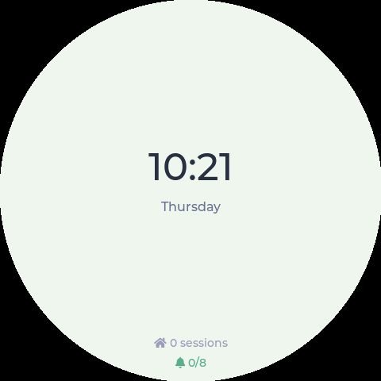
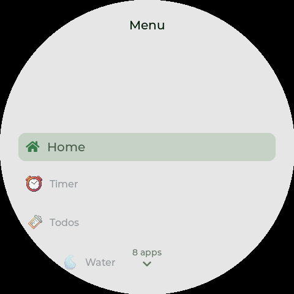
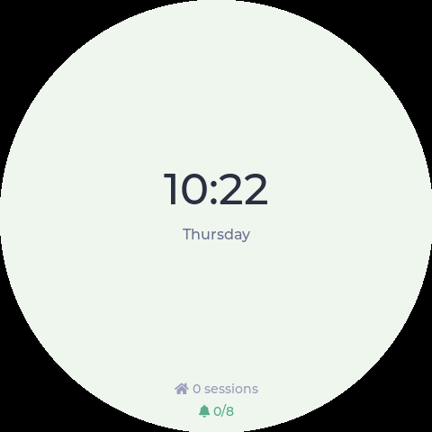
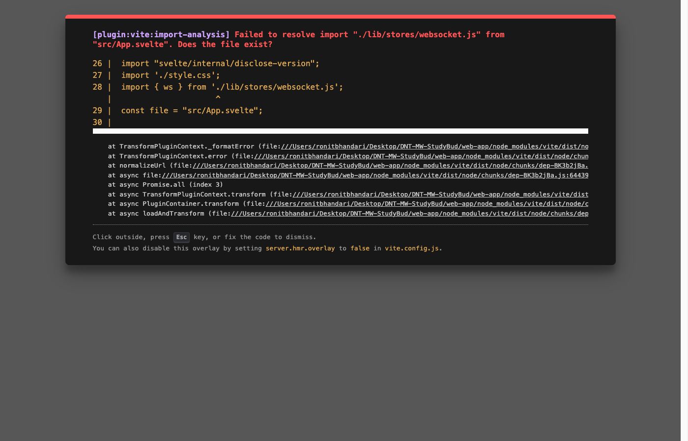
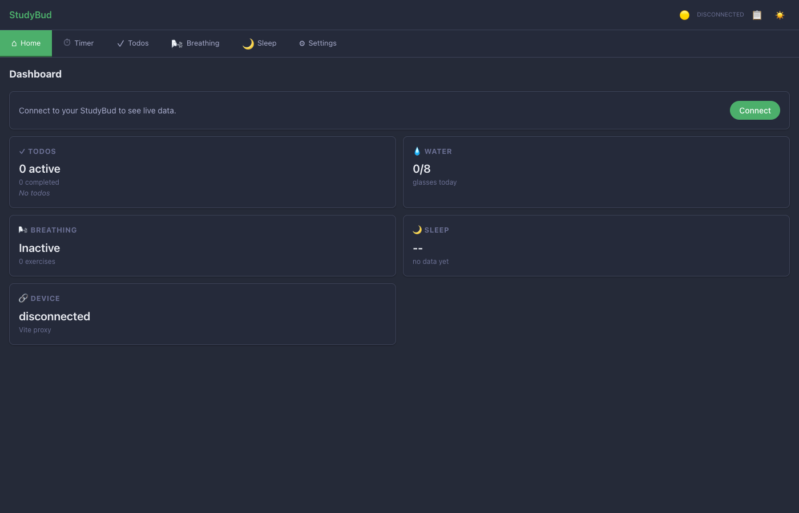

# StudyBud Version Log

Automated version log tracking the evolution of the StudyBud LVGL embedded app and its companion Svelte web dashboard.

Screenshots captured via headless SDL simulator with automated navigation scripts and Chrome headless for web screenshots.

---

## 02 — Todo List + Periwinkle Theme
**Date:** 2026-07-18 | **Commit:** `54aa33c`

Initial functional build with todo list screen, radial scroll menu, long-press navigation, and periwinkle theme.

**Menu:** Home · Timer · Todos · Water · Breathing · Settings

| Home | Menu | Todos |
|------|------|-------|
|  |  |  |

---

## 03 — Breathing Exercise App
**Date:** 2026-07-21 | **Commit:** `e27ac4c`

Added breathing exercise screen with guided inhale/exhale animation.

**Menu:** Home · Timer · Todos · Water · Breathing · Settings

| Home | Menu | Breathing |
|------|------|-----------|
|  |  |  |

---

## 04 — Idle Background Animation
**Date:** 2026-07-23 | **Commit:** `093e68f`

Added Backgrounds menu item and idle background selection screen with animated tree theme.

**Menu:** Home · Timer · Todos · Water · Breathing · Settings · Backgrounds

| Home | Menu | Backgrounds |
|------|------|-------------|
|  |  |  |

---

## 05 — Sleep Tracker
**Date:** 2026-07-25 | **Commit:** `b23bf63`

Added Sleep tracking screen with sleep duration and quality logging.

**Menu:** Home · Timer · Todos · Water · Breathing · Settings · Backgrounds · Sleep

| Home | Menu | Sleep |
|------|------|-------|
|  |  |  |

---

## 06 — New Menu Logos
**Date:** 2026-07-26 | **Commit:** `9dbab40`

Added custom SVG-based logos to each menu item for a polished visual identity.

**Menu:** Home · Timer · Todos · Water · Breathing · Settings · Backgrounds · Sleep

| Home | Menu with Logos |
|------|-----------------|
|  |  |

---

## 07 — Pomodoro Timer App
**Date:** 2026-07-26 | **Commit:** `5bf5a79`

Added full timer screen with Pomodoro presets (25/5, 50/10, custom) and countdown display.

**Menu:** Home · Timer · Todos · Water · Breathing · Settings · Backgrounds · Sleep

| Home | Menu | Timer Presets |
|------|------|---------------|
|  |  |  |

---

## 08 — Svelte Web Dashboard (Basic)
**Date:** 2026-07-23 | **Commit:** `f4cb574`

First version of the companion Svelte web app for remote monitoring of the LVGL device via WiFi/Bluetooth.

| Svelte Basic |
|--------------|
|  |

---

## 09 — Svelte Web Dashboard (Polished)
**Date:** 2026-07-30 | **Commit:** `48e7509`

Refined Svelte dashboard with shared app_state, live display sync, and improved networking layers.

| Svelte Polished |
|-----------------|
|  |

---

## 10 — Latest Build (Current)
**Date:** 2026-08-02 | **Branch:** `fix_timer_LVLGL`

All features combined: Tamagotchi pet, Stretch Break, Timer, Todos, Breathing, Water, Sleep, Backgrounds, and Settings. 10-item menu with full navigation.

**Menu:** Home · Tamagotchi · Breathing · Water · Stretch Break · Sleep · Timer · Todos · Backgrounds · Settings

| Home | Menu | Tamagotchi | Breathing | Water |
|------|------|------------|-----------|-------|
|  |  |  |  |  |

| Stretch Break | Sleep | Timer | Todos | Backgrounds |
|---------------|-------|-------|-------|-------------|
|  |  |  |  |  |
